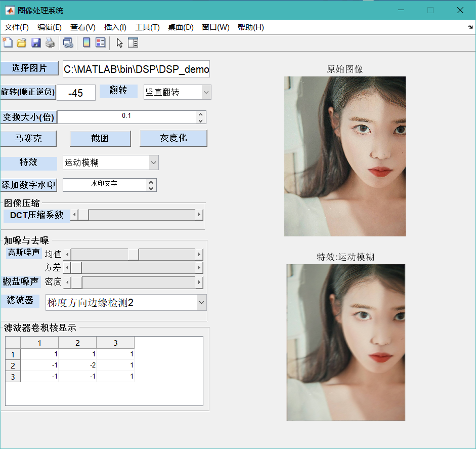

### DIP-Demo
基于MatLab的数字图像处理demo

### 概述
给出一个二维灰度或者彩色图像，
1.	实现对图像进行不同卷积核的运算。
2.	实现图像的加噪、低通滤波、高通滤波、边缘检测、高斯滤波等:使用对应的卷积核
3.	对图像进行特效处理（模糊、马赛克、各种其他特效等）。
4.	对图像进行任意倍数放大和缩小、任意角度旋转。
5.	有图形交互界面。
6.	其他创意性功能。

### 项目文件说明
* photo-test是测试所用的文件夹;
* app.fig和app.m分别是使用MatLab页面布局设计文件;
* app.m是逻辑实现代码;
* Overall-Display.mp4是演示录屏。

### 使用说明
1. 演示环境是MatLab R2021a;
2. 将整个工程文件下载;
3. 命令行中输入
   ~~~
   cd('路径名');
4. 运行app.m

### 结果演示
1. 主页面显示: 
2. 其他的功能详细效果见Overall-Display.mp4演示(下载后查看).
